## READ-ME
Pennkey: nmaga

Live demo: https://nmagarino.github.io/homework-6-particle-system-nmagarino/

Resources:
* "https://cis700-procedural-graphics.github.io/files/dynamics_2_28_17.pdf" - For reference in Euler integration for particle physics
* "http://www.typescriptgames.com/MouseInput.html" - Helped in implementing mouse coordinate detection
* "http://antongerdelan.net/opengl/raycasting.html" For reference in ray casting

The controls for the particle simulation start as such:

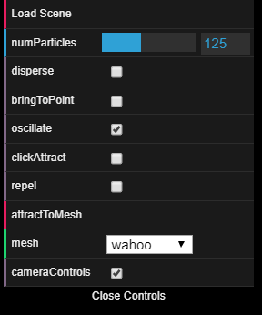

My simulation starts with a 2d grid of 120x120 pixels.  If we switch on disperse, the particles will be given a random acceleration and eventually travel away from their original positions.  These random accelerations are given at each tick, so particles may appear to rapidly change direction.
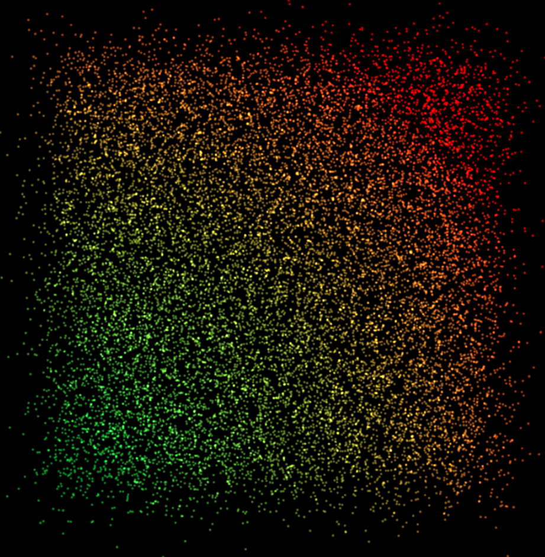

After dispersing in 3d, we can then switch on bringToPoint, which will create an attractive force from the origin, (0,0,0), on each particle.  This is the negated position vector of each particle scaled down a bit.
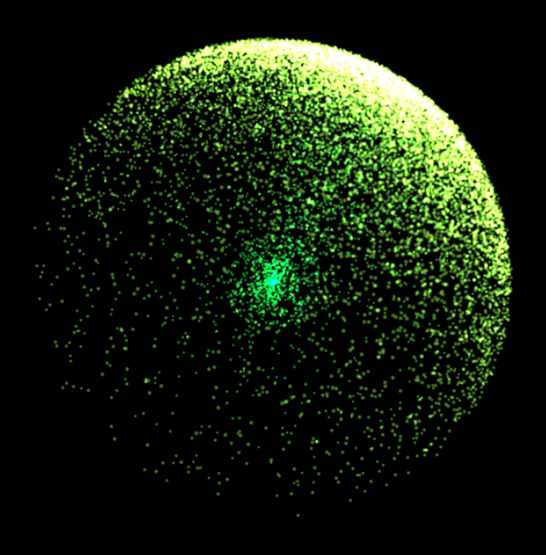

If we turn off oscillate, then particles will begin to collect at the origin, instead of shooting through it.
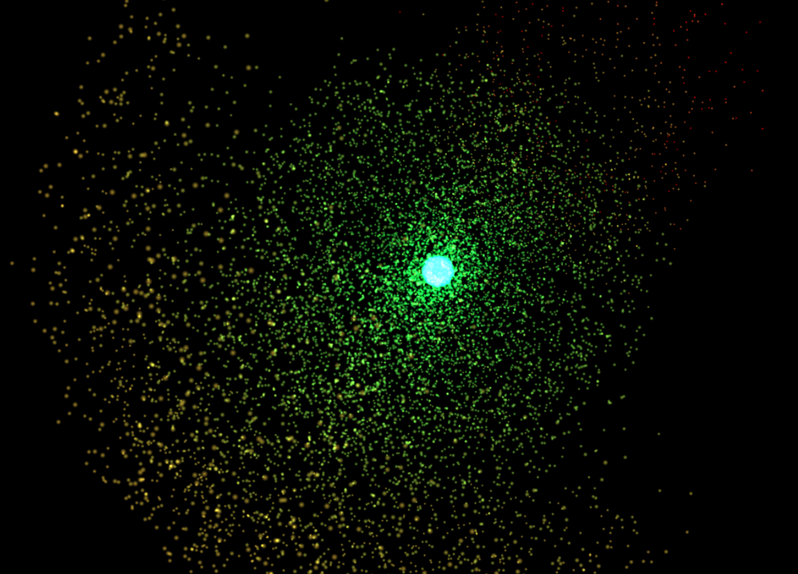

If we then turn on clickAttract, we can change this point of attraction from the origin to the relative position of the mouse on screen (translated into a 3d point, of course).
I think this works in a particularly cool way in 2d.  So, if we turn on oscillate, bringToPoint, and clickAttract, THEN turn on disperse, the particles will create a cool shape as they all move to the center.  Then, we can slightly throw off the particles' paths by attracting them to different points for a time with the mouse, resulting in really interesting 2d patterns!
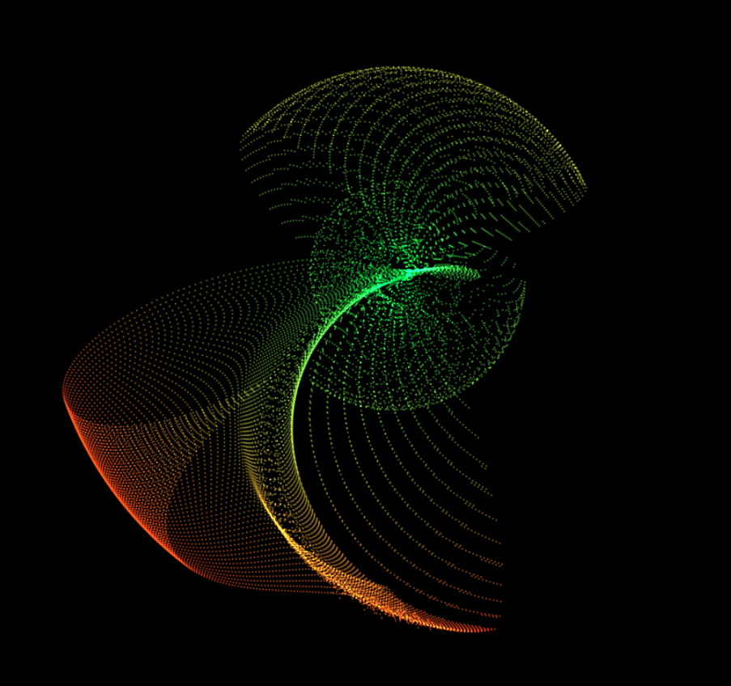
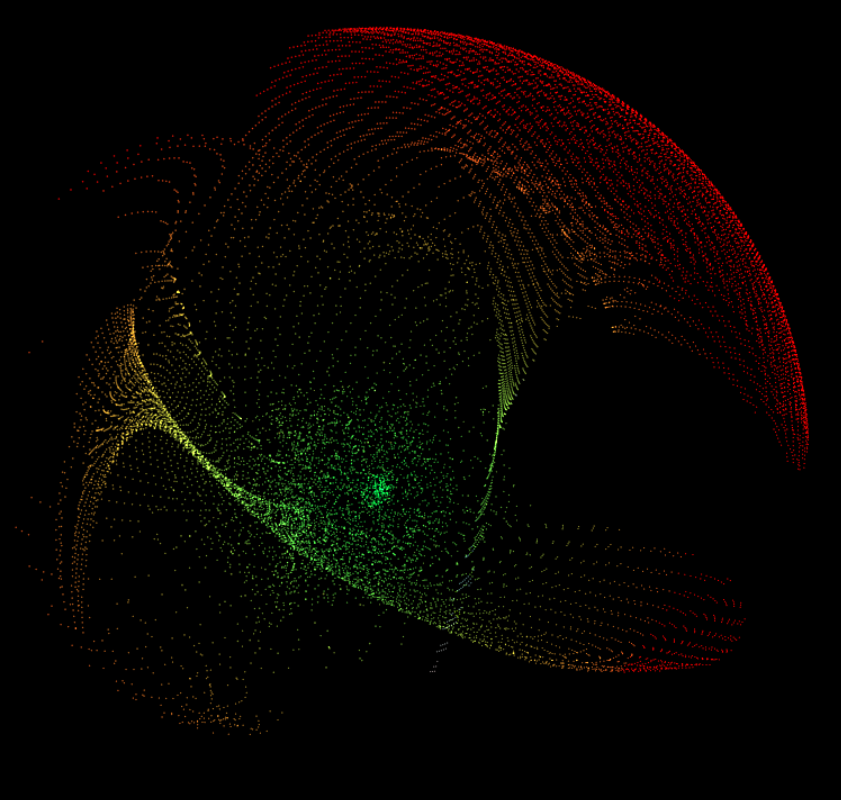

With bringToPoint on, with or without clickAttract on, we can turn on repel to do the opposite -- specifically repel the particles from some point.  You will easily end up losing some of your particles though.
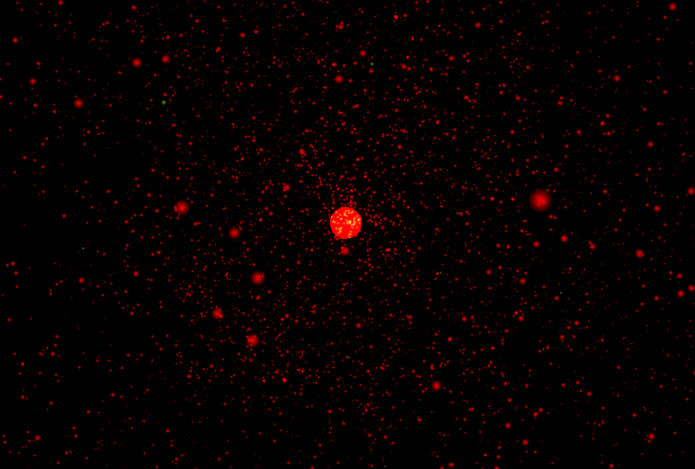

It's neat in 2d, looking almost like a ripped cloth!
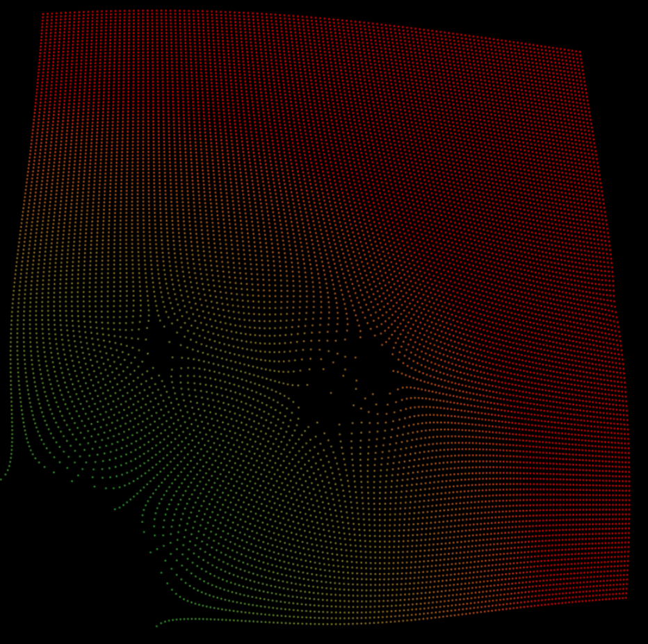

Lastly, the particles can be attracted to the mesh specified in the drop-down menu, by clicking attractToMesh.
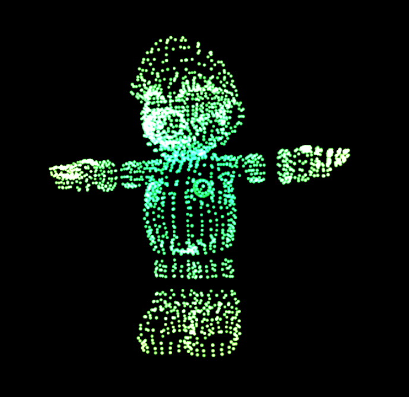

From there we can do any of the things above!  Such as this...goodbye Wahoo...
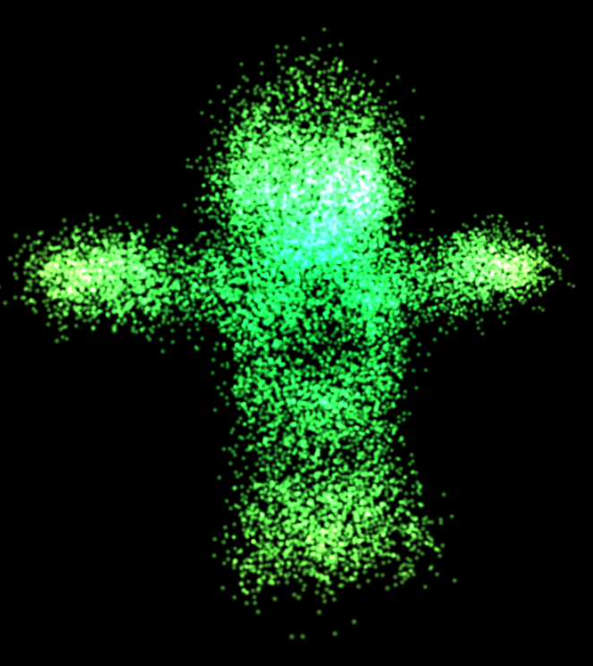

Attracting the mesh to the origin is my favorite.  It warps the mesh in cool ways.  This used to be a cow:
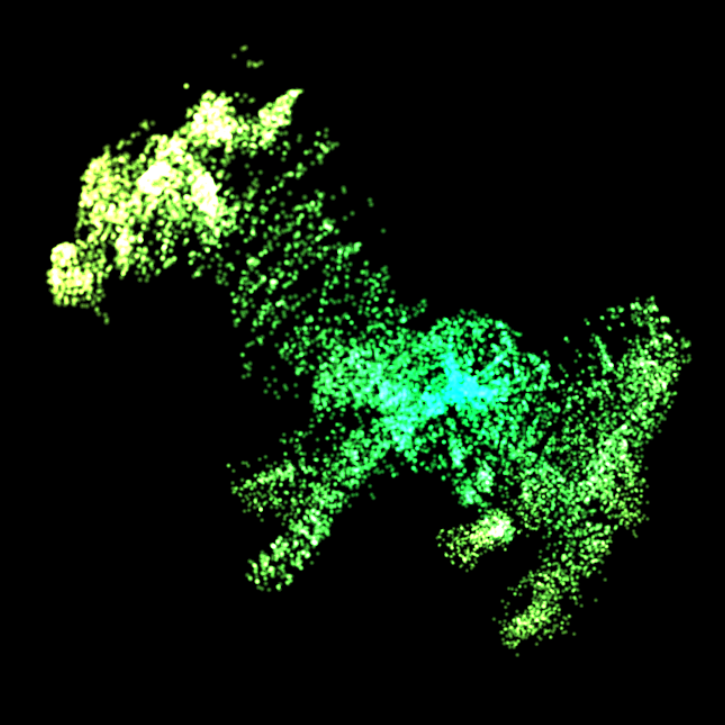

But really, pressing random things on and off is the way to make something look cool in this particle simulation.  Have fun!

